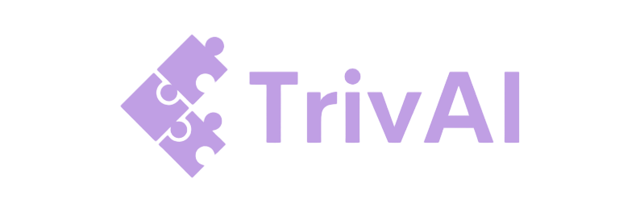

<!-- Improved compatibility of back to top link: See: https://github.com/othneildrew/Best-README-Template/pull/73 -->
<a name="readme-top"></a>

<!-- PROJECT SHIELDS -->
<!--
*** I'm using markdown "reference style" links for readability.
*** Reference links are enclosed in brackets [ ] instead of parentheses ( ).
*** See the bottom of this document for the declaration of the reference variables
*** for contributors-url, forks-url, etc. This is an optional, concise syntax you may use.
*** https://www.markdownguide.org/basic-syntax/#reference-style-links
-->

<!-- PROJECT LOGO -->
<br />
<div align="center">
  <a href="https://github.com/NotAtec/RU_ResearchNDevelopment">
    
  </a>

<h3 align="center">TrivAI: A project for <a href="https://www.ru.nl/studiegids/science/vm/osirislinks/ipc/nwi-ipc030/">NWI-IPC030</a></h3>

  <p align="center">
    TrivAI is a trivia game that uses AI to generate questions based on a given topic. The game is played online, in a 1v1 setting. 
    <br />
    <br />
    <a href="https://ru-rnd.herokuapp.com/">View Live Hosted Demo</a>
    ·
    <a href="https://github.com/NotAtec/RU_ResearchNDevelopment/issues">Report Bug</a>
    ·
    <a href="https://github.com/NotAtec/RU_ResearchNDevelopment/issues">Request Feature</a>
  </p>
</div>


<!-- TABLE OF CONTENTS -->
<details>
  <summary>Table of Contents</summary>
  <ol>
    <li>
      <a href="#about-the-project">About The Project</a>
      <ul>
        <li><a href="#built-with">Built With</a></li>
      </ul>
    </li>
    <li>
      <a href="#getting-started">Getting Started</a>
      <ul>
        <li><a href="#prerequisites">Prerequisites</a></li>
        <li><a href="#installation">Installation</a></li>
      </ul>
    </li>
    <li><a href="#roadmap">Roadmap</a></li>
  </ol>
</details>


<!-- ABOUT THE PROJECT -->
## About The Project

For the NWI-IPC030 "Research & Development" course at Radboud University, we had to create "something". We decided to create a trivia game using ChatGPT. Played in a 1v1 setting, it isn't too complicated but features MVC architecture, a database, and tries to keep to the DRY principle.


<p align="right">(<a href="#readme-top">back to top</a>)</p>


### Built With

* 
* 
* 
* 

<p align="right">(<a href="#readme-top">back to top</a>)</p>


<!-- GETTING STARTED -->
## Getting Started

To get a local copy of TrivAI going, follow the following steps below.

### Prerequisites

Before setting up the project, make sure you have the following installed:
* Ruby 3.1.4
* Rails 7
* Postgres 14 or above
* NodeJS 16.0 or above
* Yarn 1.22 or above

### Installation

1. Clone the repo
   ```sh
   git clone git@github.com:NotAtec/RU_ResearchNDevelopment.git
   ```
3. Setup rails dependencies within the project folder
   ```sh
   bundle install
   rails turbo:install
   rails stimulus:install
   rails javascript:install:webpack
   rails css:install:bulma
   yarn build:css
   yarn build
   ```
4. Setup the database
   ```sh
   rails db:create
   rails db:migrate
   rails db:seed
   ```
5. Start the server
   ```sh
   bin/dev
   ```
<p align="right">(<a href="#readme-top">back to top</a>)</p>


<!-- ROADMAP -->
## Roadmap

- [x] Base Game
- [x] ChatGPT Plain Ruby Implementation
- [ ] ChatGPT Rails Implementation
    - [ ] Port Ruby Implementation to Rails
    - [ ] Make GPT save to database
    - [ ] Add ChatGPT to Game

See the [open issues](https://github.com/NotAtec/RU_ResearchNDevelopment/issues) for a full list of proposed features (and known issues).

<p align="right">(<a href="#readme-top">back to top</a>)</p>
